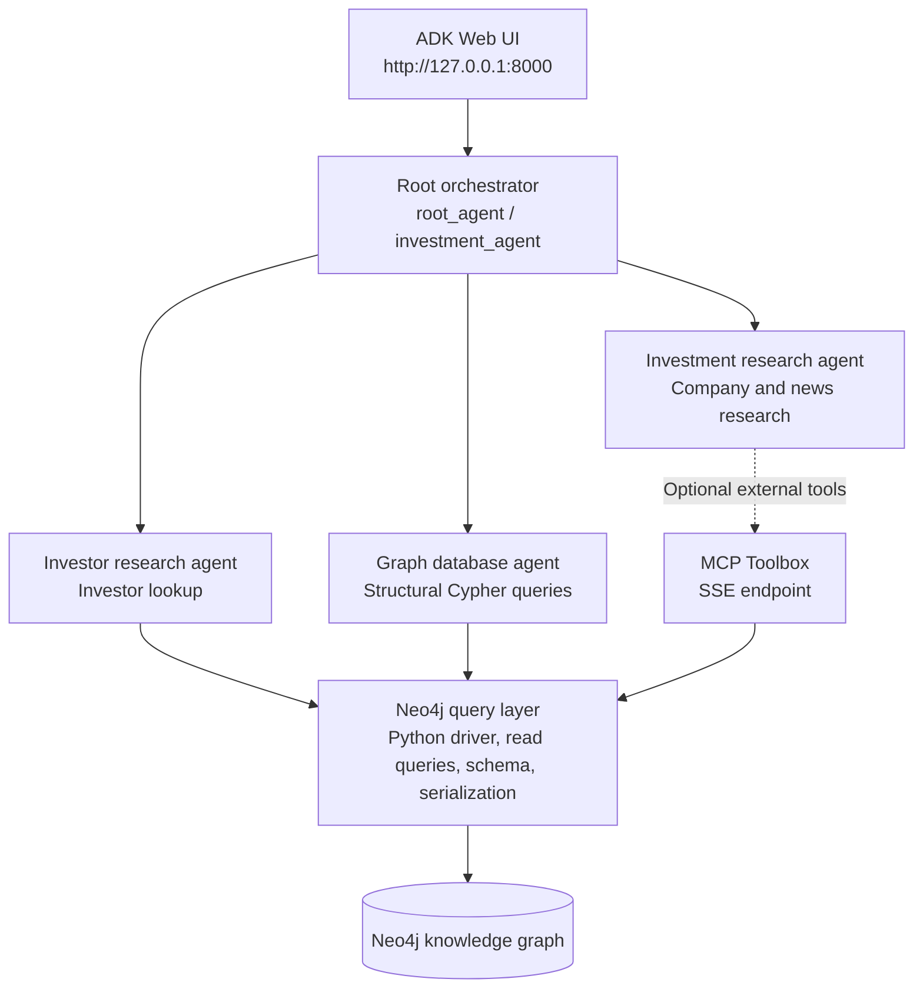

# CapitalIntel Graph Agent

An AI-powered multi-agent investment intelligence system built to analyze corporate networks, financial relationships, executive connections, and news sentiment using a Neo4j Knowledge Graph, Model Context Protocol (MCP), and the Agent Development Kit (ADK) framework.

---

## Overview

CapitalIntel Graph Agent automates complex market and investment research by querying a graph database containing companies, investors, executives, and news articles. Rather than relying on standard unstructured keyword search, the system leverages multi-agent orchestrators to generate Cypher graph queries, traverse relationship nodes, map co-investment networks, and analyze article sentiment.

---

## Key Features

- Multi-Agent Research System: Orchestrated architecture with specialized sub-agents for structural database queries, investor tracking, and corporate intelligence.
- Dynamic Cypher Generation: Translates natural language requests into Cypher queries against a Neo4j Knowledge Graph with schema inspection and automatic query retries.
- Entity and Relationship Tracking: Maps investment networks, board member associations, CEO leadership, parent-subsidiary structures, and full-text node searches.
- News Article and Sentiment Analysis: Retrieves articles within specific time ranges, links target organizations, and assesses article sentiment.
- Model Context Protocol (MCP) Integration: Supports loading external tools via MCP server endpoints over SSE connections.
- Interactive Web Interface: Built-in web UI to monitor agent reasoning, inspect tool parameters, and trace agent decision paths in real time.

---

## Architecture

The application uses Google Agent Development Kit (ADK) to expose a root orchestrator and three specialized agents. The root agent is exported as `root_agent` and is named `investment_agent`; it delegates graph questions to the specialist agents and can return combined results, including tables or charts when requested.



### Agents and data layer

- **Root orchestrator:** Routes requests to the specialist sub-agents and coordinates their responses. It can present retrieved information as tables, charts, or natural-language answers.
- **Investor research agent:** Looks up investors for a specified organization using the Neo4j-backed `get_investors` function.
- **Investment research agent:** Uses the tools loaded from the optional MCP Toolbox endpoint for company, industry, and article research. The project's `tools.yaml` template includes examples such as company full-text search, articles by month, article details, and people associated with a company.
- **Graph database agent:** Inspects the graph schema and generates structural read-only Cypher queries using the Neo4j Python driver. The query layer serializes Neo4j values for agent responses and rejects write queries.
- **Knowledge graph:** The documented labels include `Organization`, `Person`, `Article`, and `IndustryCategory`. Relationships include `HAS_INVESTOR`, `HAS_CEO`, `HAS_BOARD_MEMBER`, `HAS_CATEGORY`, `MENTIONS`, and `HAS_SUBSIDIARY`. The configured database determines the actual schema and data volume; the source currently notes approximately 237,358 nodes for its example dataset.

### MCP Toolbox and web search

This project does **not** implement a built-in public-web search tool. It can load tools from an external Model Context Protocol (MCP) server over Server-Sent Events (SSE), configured with `MCP_TOOLBOX_URL` in `.env`. When configured and reachable, the investment research agent receives the server's tools, plus the local schema-inspection tool. MCP servers may provide web search, but that capability depends on the external server and its configuration; it is not supplied by this repository itself.

If `MCP_TOOLBOX_URL` is unset, the investment research agent is initialized with only the local schema tool, so its MCP-provided company and article tools are unavailable. Neo4j access for the investor and graph database agents is provided directly by the Python driver, independently of MCP.

To configure the external tools, set up an MCP Toolbox server, configure its Neo4j source and tools (see `investment_agent/.adk/tools.yaml.template` and `setup_tools_yaml.py`), then set `MCP_TOOLBOX_URL` to the server's SSE endpoint. Keep database credentials and endpoint details in `.env`, not in committed files.

---

## Repository Structure

```
.
├── investment_agent/
│   ├── agent.py            # Core agent declarations, Neo4j driver, Cypher tools, and MCP loader
│   ├── __init__.py         # Package entry and environment initialization (Gemini / Vertex AI)
│   └── .adk/               # ADK configuration directory
│       └── tools.yaml.template # Template file for Neo4j Cypher tool definitions
├── main.py                 # CLI entrypoint and execution instructions
├── setup_tools_yaml.py     # Script to generate tools.yaml dynamically from environment variables
├── example.env             # Template for required environment configuration variables
├── requirements.txt        # Python dependency manifest
├── .gitignore              # Repository git ignore rules
└── README.md               # System documentation
```

---

## Quick Start & Installation

### Prerequisites

- Python 3.11 or higher
- `uv` package manager (recommended) or `pip`
- Accessible Neo4j Graph Database instance
- Gemini API Key or Google Cloud Vertex AI credentials

### Installation Steps

1. Clone the repository:
   ```bash
   git clone https://github.com/roggyy/CapitalIntel-Graph-Agent.git
   cd CapitalIntel-Graph-Agent
   ```

2. Create and activate a virtual environment:
   ```bash
   uv venv
   source .venv/bin/activate   # On Linux / macOS
   # .venv\Scripts\activate    # On Windows
   ```

3. Install project dependencies:
   ```bash
   uv pip install -r requirements.txt
   ```

### Configuration

1. Create a `.env` file from the provided template:
   ```bash
   cp example.env .env
   ```

2. Populate `.env` with your credentials:
   ```env
   NEO4J_URI=neo4j+s://demo.neo4jlabs.com
   NEO4J_USERNAME=companies
   NEO4J_PASSWORD=companies
   NEO4J_DATABASE=companies

   GOOGLE_GENAI_USE_VERTEXAI=0
   GOOGLE_API_KEY=your_api_key_here
   GOOGLE_ADK_MODEL=gemini-3.5-flash

   MCP_TOOLBOX_URL=https://toolbox-990868019953.us-central1.run.app/mcp/sse
   ```

3. Generate the runtime `tools.yaml` configuration:
   ```bash
   python setup_tools_yaml.py
   ```

---

## Command-Line Usage and Execution

### Launch Interactive Web Interface

To launch the multi-agent web interface:

```bash
uv run adk web
```

Access the interface in your browser at `http://127.0.0.1:8000`, select `root_agent` (or `investment_agent`), and issue natural language prompts.

### Execute Main Script

To display CLI usage instructions:

```bash
python main.py
```

### Example Research Prompts

- "Who are the primary investors in ByteDance and what other portfolio companies do they hold?"
- "Find all companies in the Technology category and list their CEOs and board members."
- "Show positive news articles published in January 2023 along with the organizations mentioned in them."

---

## Data Schema & Output Formats

### Graph Database Node & Relationship Types

- Node Labels: `Organization`, `Person`, `Article`, `IndustryCategory`
- Relationship Types: `HAS_INVESTOR`, `HAS_CEO`, `HAS_BOARD_MEMBER`, `HAS_CATEGORY`, `MENTIONS`, `HAS_SUBSIDIARY`

### Sample Cypher Tool Output Format (JSON)

When querying investors or graph schema, data is serialized into ISO-compliant JSON data structures:

```json
[
  {
    "id": "org_10293",
    "name": "Sequoia Capital",
    "type": "Organization"
  },
  {
    "id": "person_4821",
    "name": "Neil Shen",
    "type": "Person"
  }
]
```

### Sample Article Metadata Schema (JSON)

```json
[
  {
    "article_id": "art_88392",
    "author": "TechCrunch",
    "title": "Global Market Trends Q1",
    "date": "2023-01-15",
    "sentiment": "Positive",
    "site": "techcrunch.com",
    "summary": "Overview of funding rounds in tech sector."
  }
]
```

---

## Tech Stack & Dependencies

- Programming Language: Python 3.11+
- Multi-Agent Framework: Agent Development Kit (ADK) (`google-adk >= 1.21.0`)
- Graph Database Driver: Neo4j Python Driver (`neo4j >= 6.0.3`)
- Integration Standard: Model Context Protocol (MCP) (`MCPToolset`, SSE Connection)
- Environment Management: `python-dotenv >= 1.0.0`
- Model Provider: Gemini 3.5 Flash / Vertex AI

---

## Contribution Guidelines

Contributions are welcome. Please follow these guidelines:

1. Fork the repository and create a feature branch (`git checkout -b feature/your-feature-name`).
2. Ensure code formatting aligns with PEP 8 standards.
3. Verify that environment variables and credentials are not committed to source control.
4. Test Cypher query logic against a test Neo4j database instance.
5. Open a Pull Request with a clear summary of your changes.
